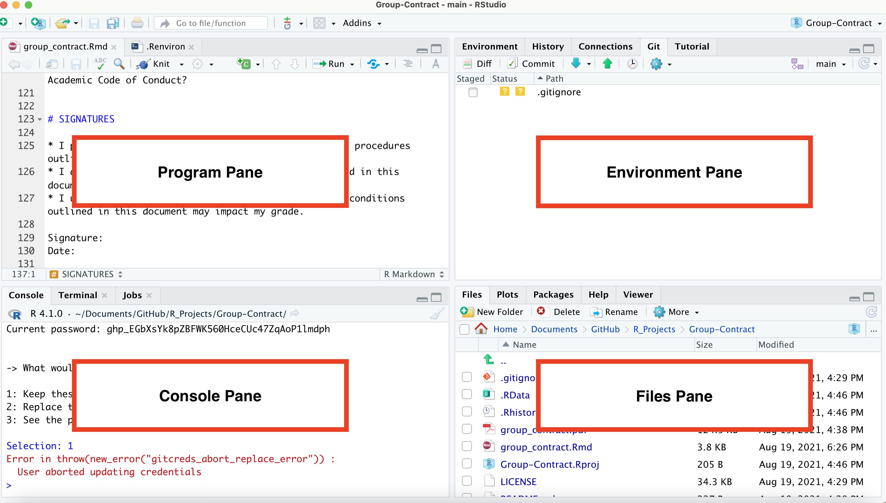

# Setting up your R Environment

1. Follow the instructions in chapters 4-6 at https://happygitwithr.com/ to create a GitHub account, install R and RStudio. 
2. Open RStudio.
3. Follow instructions in this video to ensure git is installed: 

<iframe src="https://player.vimeo.com/video/511798611?h=4b4bf40c1b&color=6cabdd&byline=0&portrait=0" width="320" height="180" frameborder="0" allow="autoplay; fullscreen; picture-in-picture" allowfullscreen></iframe>
<p><a href="https://vimeo.com/511798611">Verify Git Installation</a> from <a href="https://vimeo.com/user95475944">David Keyes</a> on <a href="https://vimeo.com">Vimeo</a>.</p>

4. If git is not installed, follow instructions in chapter 7 at https://happygitwithr.com/
5. Edit your git config by following these instructions: 

<iframe src="https://player.vimeo.com/video/511798861?h=d697c25083&color=6cabdd&byline=0&portrait=0" width="320" height="180" frameborder="0" allow="autoplay; fullscreen; picture-in-picture" allowfullscreen></iframe>
<p><a href="https://vimeo.com/511798861">Edit gitconfig file</a> from <a href="https://vimeo.com/user95475944">David Keyes</a> on <a href="https://vimeo.com">Vimeo</a>.</p>

6. Create a personal access token by following these instructions: 

<iframe src="https://player.vimeo.com/video/511801645?h=3a59d9cef2&color=6cabdd&byline=0&portrait=0" width="320" height="180" frameborder="0" allow="autoplay; fullscreen; picture-in-picture" allowfullscreen></iframe>
<p><a href="https://vimeo.com/511801645">Create a Personal Access Token (PAT) on GitHub</a> from <a href="https://vimeo.com/user95475944">David Keyes</a> on <a href="https://vimeo.com">Vimeo</a>.</p>

7. Store your personal access token by following these instructions: 

<iframe src="https://player.vimeo.com/video/511803103?h=11244f5dab&color=6cabdd&byline=0&portrait=0" width="320" height="180" frameborder="0" allow="autoplay; fullscreen; picture-in-picture" allowfullscreen></iframe>
<p><a href="https://vimeo.com/511803103">Store Personal Access Token to Connect RStudio and GitHub</a> from <a href="https://vimeo.com/user95475944">David Keyes</a> on <a href="https://vimeo.com">Vimeo</a>.</p>

8. Copy this URL: https://github.com/Critical-Data-Analysis-Group/on-boarding
9. Create a project in RStudio from this GitHub repo by following the instructions starting at 26 seconds of this video:

<iframe src="https://player.vimeo.com/video/511804881?h=c42152e10f&color=6cabdd&byline=0&portrait=0" width="320" height="180" frameborder="0" allow="autoplay; fullscreen; picture-in-picture" allowfullscreen></iframe>
<p><a href="https://vimeo.com/511804881">How to Connect RStudio Projects with GitHub Repositories: GitHub First</a> from <a href="https://vimeo.com/user95475944">David Keyes</a> on <a href="https://vimeo.com">Vimeo</a>.</p>

10. Install the rmarkdown package in RStudio by entering the following lines of code in the Console Pane of RStudio (lower left hand corer on initial install).  

```
install.packages("rmarkdown")
library(rmarkdown)
```



11. Open the file getting-started.Rmd in the Files tab of RStudio. On the initial install, the Files tab will be in the lower right hand corner of RStudio.
12. Follow instructions in getting-started.Rmd.
13. When the file tells you to commit your code, follow the instructions in this video starting at 14 seconds: 

<iframe src="https://player.vimeo.com/video/511800674?h=74f4dad46a&color=6cabdd&byline=0&portrait=0" width="320" height="180" frameborder="0" allow="autoplay; fullscreen; picture-in-picture" allowfullscreen></iframe>
<p><a href="https://vimeo.com/511800674">Make a Commit and View More History</a> from <a href="https://vimeo.com/user95475944">David Keyes</a> on <a href="https://vimeo.com">Vimeo</a>.</p>

14. Push your code to GitHub.com by following the instructions in this video starting at 27 seconds:

<iframe src="https://player.vimeo.com/video/511805399?h=10edb6f8cc&color=6cabdd&byline=0&portrait=0" width="320" height="180" frameborder="0" allow="autoplay; fullscreen; picture-in-picture" allowfullscreen></iframe>
<p><a href="https://vimeo.com/511805399">General Workflow: Push</a> from <a href="https://vimeo.com/user95475944">David Keyes</a> on <a href="https://vimeo.com">Vimeo</a>.</p>
